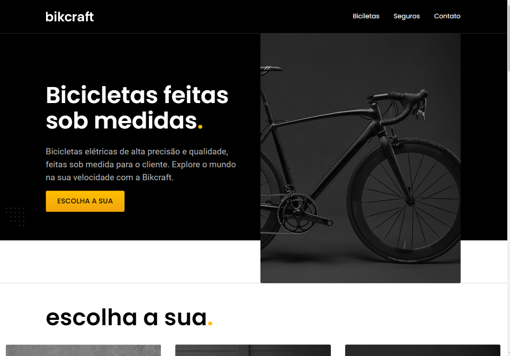

[banner-github](https://github.com/emmanuelmarcosdeoliveira/template-frontend/blob/main/assets/banner%20template.png)

[Descrição](#descrição) |
[Funcionalidades](#funcionalidades) |
[Screenshot ou Gif](#screenshots-ou-gif) |
[Demostração](n#demonstração) |
[Deploy](#deploy) |
[Aprendizados](#aprendizados) |
[Referencias](#referência) |

# Projeto Bikcraft
 

## 
 ✅ Descrição do projeto: 

> Esse projeto faz parte do Curso de HTML  e CSS para inicantes da [Origamid](https://origamid.com/). Ele é o 
   projeto final do curso nele aprendemos vários coneceitos de _HTML_, _CSS_ e um  **básico de JavaScript**. Esse > projeto faz parte também do Curso de **UI Design para iniciantes** . Onde primeiro construimos o layout do >    projeto no figma aprendendo também vairos conceitos de UI  para depois contruimos o projeto na Web.

 ##  
 🎨Layout no Figma

### Abaixo print do projeto no Figma e acesso o projeto atráves do _link_ 

| Link Figma | Imagem |
|:--------:|:-----------:| 
| [Bikcraft ](https://bikcraft-woad.vercel.app/) | |

## 
  ⚙️ Funcionalidades

- Responsividade
- Break points
- Multiplataforma

## 
📸 Imagens do Projeto verão web.
 
 

## 
📱 Imagens do Projeto verão Mobile.
 
 

## 
🪛Tecnologias Utilizadas 
- [x] HTML
- [x] CSS
- [x] JAVASCRIPT

## 
 🛣️ Como Executar esse projeto ?
Para ter Acesso ao Projeto; clique no link Abaixo:   
> [Bikcraft ](https://bikcraft-woad.vercel.app/)

## 
 👨🏻‍🦱Autor
[Dev-Oliveira](https://github.com/emmanuelmarcosdeoliveira)

## Referências 

> :memo: **Note:** [Origamid](https://origamid.com)
