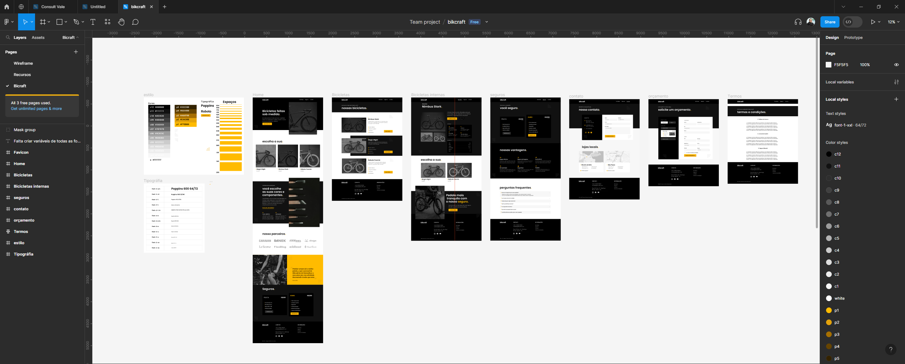
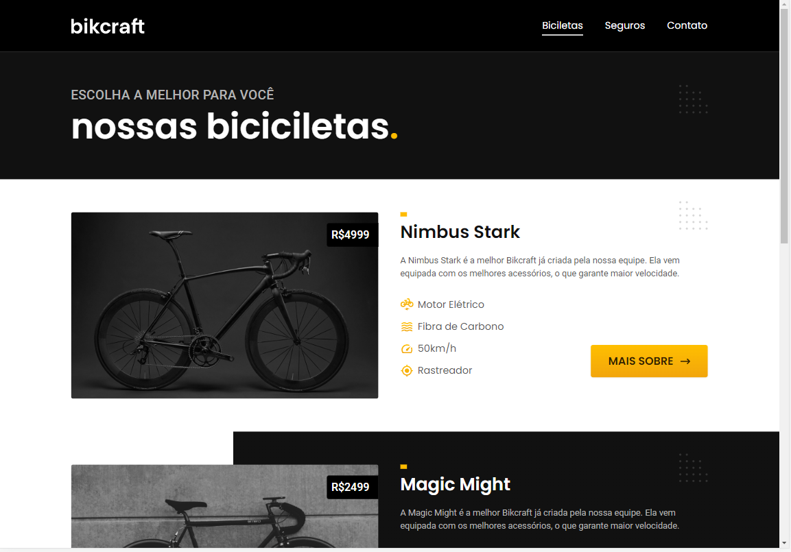
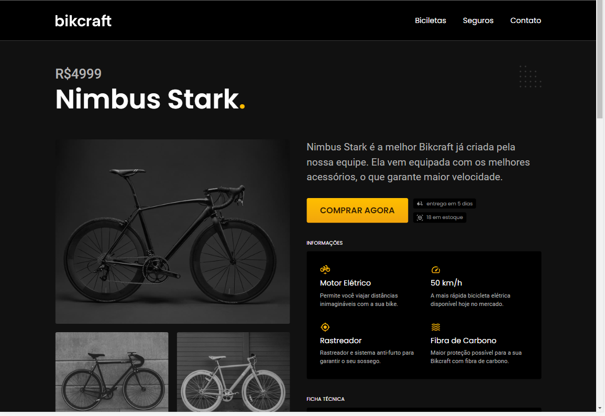
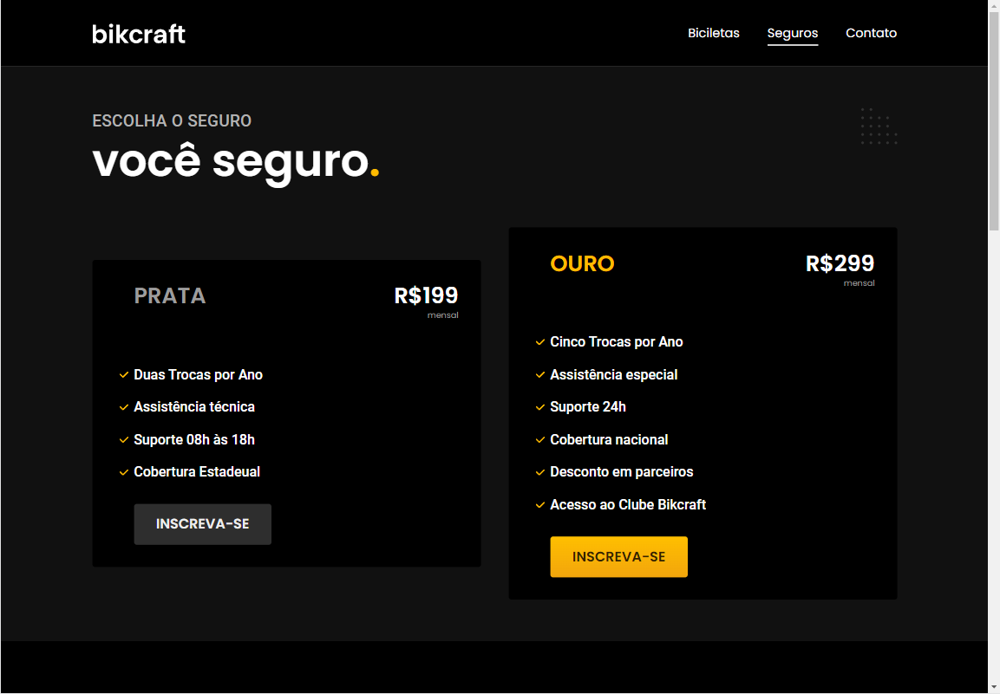
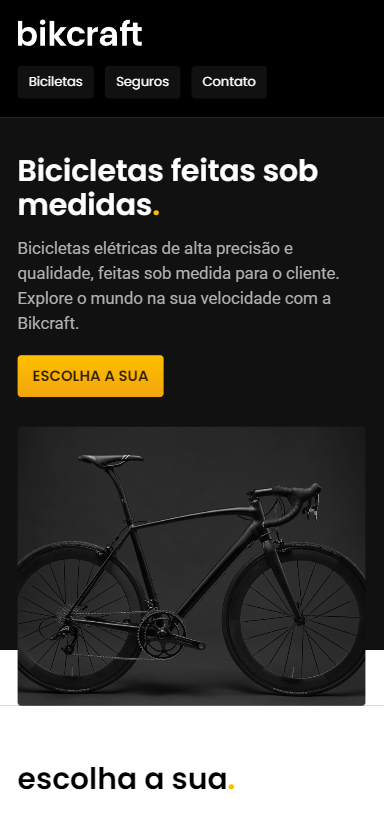
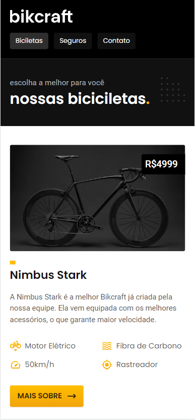
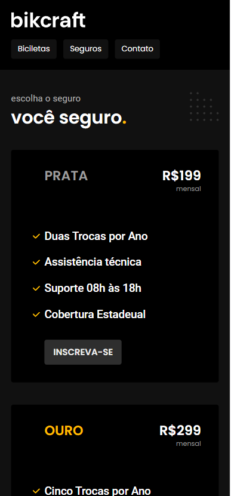
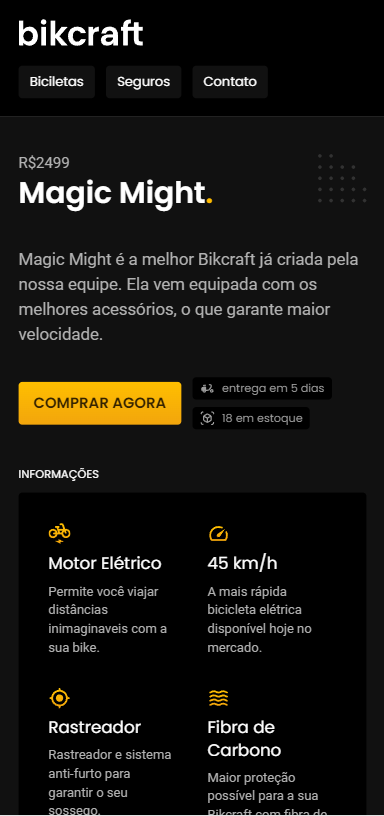

 
 

[Descrição](#--descrição-do-projeto-) |
[Funcionalidades](#%EF%B8%8F-funcionalidades) |
[Imagens](#-imagens-do-projeto-verão-web) |
[Tecnologias](#tecnologias-utilizadas-) |
[Como executar esse projeto ?](#%EF%B8%8F-como-executar-esse-projeto-) |
[Referencias](#-referências-) |
[Autor](#-autor-) |

<h1 text-align="center"> 🌟Bikcraft🌟</h1> 
 

<h2> ✅ Descrição do projeto: </h2> 

> Esse projeto faz parte do Curso de HTML  e CSS para inicantes da [Origamid](https://origamid.com/). Ele é o 
   projeto final do curso nele aprendemos vários coneceitos de _HTML_, _CSS_ e um  **básico de JavaScript**. Esse > projeto faz parte também do Curso de **UI Design para iniciantes** . Onde primeiro construimos o layout do >    projeto no figma aprendendo também vairos conceitos de UI  para depois contruimos o projeto na Web.

<h2> 🎨Layout no Figma </h2>

## Abaixo print do projeto no Figma e acesso o projeto atráves do <ins>*link*</ins>

| Link Figma | Imagem |
|:--------:|:-----------:| 
| [Bikcraft ](https://www.figma.com/file/VpnU0dQWEySgFPf5Tlm15z/bikcraft?type=design&node-id=8%3A3&mode=design&t=Edy3VLv6YY2bv3t9-1) | |

  <h2>⚙️ Funcionalidades</h2>

 Esse projeto simula uma loja de Bicicletas Elétricas onde podemos ver os 3 modelos de Bicicletas que a <strong>Bikcraft</strong> produz. 
🟨 Nimbus Stark   
🟥 Magic Might  
🟧 Nebula Cosmic  
Aqui podemos ver os Modelos suas caracteristicas, valores e solicitar um orçamento atráves de um formulário, pois as biciletas são fabricadas sob Medida.

 <h2>📸 Imagens do Projeto verão web.</h2>
 

 

 
  

 <h2>📱 Imagens do Projeto verão Mobile.</h2>
 
 
 
 

<h2>🪛Tecnologias Utilizadas </h2>

- [x] HTML
- [x] CSS
- [x] JAVASCRIPT

 <h2>🛣️ Como Executar esse projeto ?</h2>

Para ter Acesso ao Projeto; clique no link Abaixo:   
> [Bikcraft ](https://bikcraft-woad.vercel.app/)

<h2> 📚Referências </h2>

> :memo: **Note:** [Origamid](https://origamid.com)

 <h2>👨🏻‍🦱 Autor </h2>
<h3> <a href="https://oliveira-portifolio.vercel.app/">Dev-Oliveira</a> </h3>

  
    
   
&copy; Todos os Direitos Reservados

<h1> 😁Obrigado por chegar até aqui!</h1>

